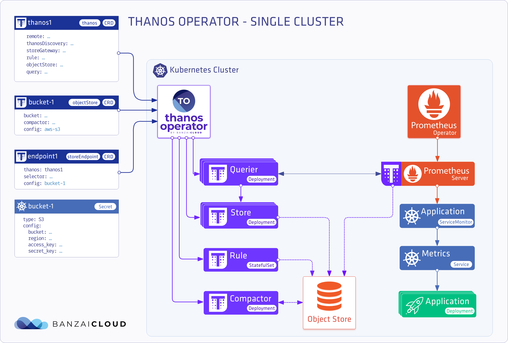

<p align="center"></p>
<p align="center">


# Single Cluster Thanos Install

<p align="center"></p>


## Prerequisites for Thanos

1. Create `monitor` namespace
    ```bash
    kubectl create namespace monitor
    ```

1. Create Object Store secret

    Example S3 configuration
    ```
    cat <<'EOF' >> object-store.yaml
    type: S3
    config:
      endpoint: "s3.eu-west-1.amazonaws.com"
      bucket: "test-bucket"
      region: "eu-west-1"
      access_key: "XXXXXXXXX"
      secret_key: "XXXXXXXXXXXXXXXXXXXXXXXXXXXXXXXXXXXX"
    EOF
    ```

1. Deploy the secret on Kubernetes
    ```
    kubectl create secret generic thanos --from-file=object-store.yaml=object-store.yaml --namespace monitor
    ```

1. Create the Thanos sidecar definition
    Extra configuration for prometheus operator.
    
    > Note: Prometheus-operator and Thanos MUST be in the same namespace.
    ```
    cat <<'EOF' >> thanos-sidecar.yaml
    prometheus:
      prometheusSpec:
        thanos:
          image: quay.io/thanos/thanos:v0.9.0
          version: v0.9.0
          objectStorageConfig:
            name: thanos
            key: object-store.yaml
        externalLabels: 
          cluster: thanos-operator-test
    EOF
    ```

    Remember to set `externalLabels` as it identifies the Prometheus instance for Thanos.


## Install the Thanos Operator with Helm


1. Add the Kubernetes stable Helm repository
    ```
    helm repo add stable https://kubernetes-charts.storage.googleapis.com
    helm repo update
    ```

1. Install prometheus-operator with the Thanos sidecar
    ```
    helm install prometheus-operator --namespace monitor stable/prometheus-operator -f thanos-sidecar.yaml --set manageCrds=false
    ```

1. Add the operator chart repository.
    ```bash
    helm repo add banzaicloud-stable https://kubernetes-charts.banzaicloud.com
    helm repo update
    ```
1. Install the Thanos Operator
    ```bash
    helm install thanos-operator --namespace monitor banzaicloud-stable/thanos-operator --set manageCrds=false
   ```
   
 ## Install the Thanos Operator with the One Eye CLI
   
 [One Eye](https://banzaicloud.com/docs/one-eye/overview/) will take care of installing and configuring all the dependencies.

  *install the One Eye CLI and deploy the Thanos operator*
 ```bash
 curl https://getoneeye.sh | sh && one-eye thanos install --prometheus --secret one-eye/object-store.yaml
 ```

  *verify the installation by opening the thanos query page*
 ```bash
   one-eye thanos connect
 ```
