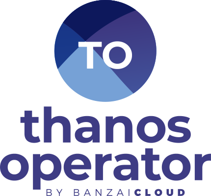

<p align="center"></p>
<p align="center">

# Thanos Operator TLS

To set up secure connection you need to generate your certs.

example TLS client, server secret
```
apiVersion: v1
kind: Secret
type: kubernetes.io/tls
metadata:
  name: example-com-server-tls
data:
  ca.crt: xxx
  tls.crt: xxx
  tls.key: xxx
```